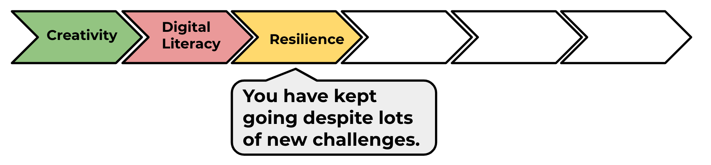

--- challenge ---
## Challenge: Advertise an event!
Can you make a poster for an event happening at your school? It could be a play, a sporting event, or even a poster advertising your Code Club!

Next, go to the 'Skills link to careers in computing' activity and then complete the next project in the HTML & CSS module 1 pathway: 'Recipe'.

--- /challenge ---

Click on the 'Click me' button to try the next project:

<a href="https://codeclub.org/en/html1">

